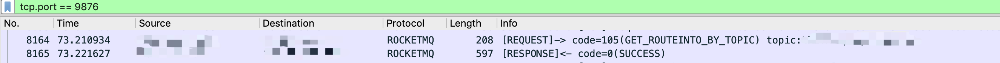
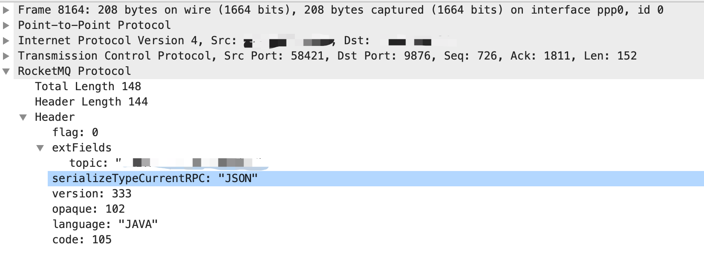

# wireshark_rocketmq_lua

## How to use

for mac
```
cp -r rocketmq-plugin /Applications/Wireshark.app/Contents/Resources/share/wireshark

then modify last line of /Applications/Wireshark.app/Contents/Resources/share/wireshark/init.lua dofile("rocketmq-plugin/rocketmq.lua")

```





## TODO

pack multiple tcp packets

## Others

thanks to https://github.com/arthur-zhang/rocketmq-wireshark-lua-plugin